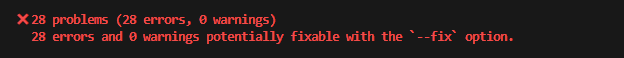
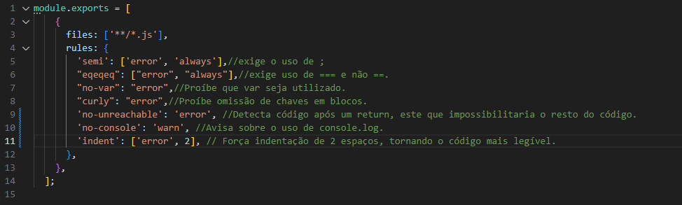
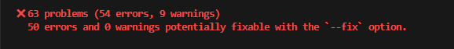
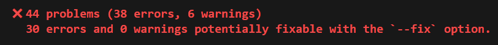

Relatório

--versão 1.0--
Depois de estudar um pouco o ESlint, testo a primeira rule, esta que retorna diversos problemas.

--versão 2.0--
Depois de testar mais algumas regras, vi avanço na identificação de erros.

--versão 3.0--
Mais algumas regras adicionadas, incluindo uma que apenas dá um warn.

--versão 4.0-- FINAL
Depois de buscar ainda mais error, cheguei em um resultado próximo do exigido, além disso, percebi que as regras que vou adicionando passaram a fazer menos impacto, ou seja, usei já as que mais fariam efeito, restando diversas que dariam apenas 1 ou dois erros a mais.

Exercício 1:

Exercício 2:

